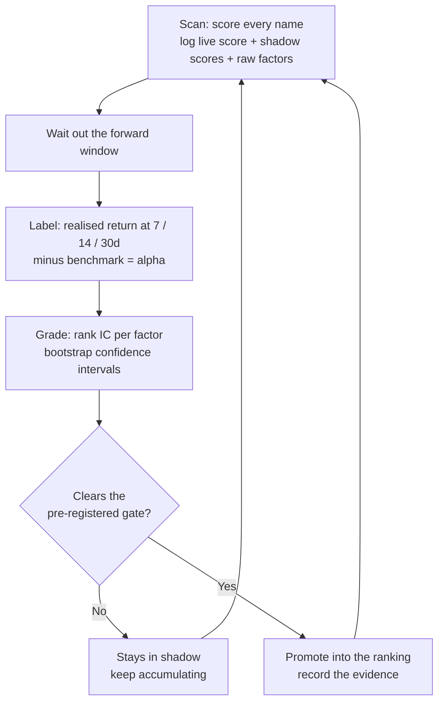

# Forward-testing a stock screener until it admitted it was wrong

**A case study in building the measurement layer first, and what happened when
it returned an answer I did not want.**

> **This repository is a methodology write-up, not a code drop.** The screener
> and its scoring calibration are private. What follows is the validation
> design, the results it produced, and the corrections that changed what those
> results meant.

I built an automated equity screener. Then I built the harness that grades it.
The harness found that the screener's own scoring model was **inverted**: the
stocks it ranked highest were the ones that went on to do worst.

This is the write-up of how that was found, what replaced it, and the
statistical corrections that turned an encouraging-looking result into an
honest one. The code is private. The method is not, and the method is the part
worth reading.

---

## If you read one section

| | |
|---|---|
| **The system** | Automated equity screener. Scans a few hundred US growth names every few days, scores them across fundamentals, catalysts, technicals and a guarded LLM narrative pass, delivers a ranked watchlist. Python, pandas, Next.js dashboard, Telegram. |
| **The real work** | A forward-testing harness that grades the screener against realised returns, with pre-registered promotion criteria and a symmetric demotion rule. |
| **What it found** | The live scoring model was an **anti-signal**. Its top-scored quartile beat the benchmark **17%** of the time. Replaced it on the pre-registered evidence. |
| **The correction that mattered** | 208 labeled picks were really **14 independent observations**. Correcting for it turned a +2.33pp headline into a result indistinguishable from luck (p=0.36). |
| **How long to actually prove it** | **122 scans, roughly 2.3 years.** Measured, not guessed. |
| **The best number, tested** | The headline result was the best of a **20-cell search**. Corrected for the search by permutation, it goes from p=0.022 to **p=0.070**. The grid is published, not just the winning cell. |
| **Honest verdict** | No demonstrated edge. Four months, one market regime. The project's value is that it can tell you that. |

---

## The system in one paragraph

Every few days a pipeline builds a universe of several hundred US-listed growth
names, filters for liquidity and solvency, and scores each survivor across four
layers: fundamentals, catalysts, technicals, and a language-model pass that
reads recent headlines and grades narrative strength with guardrails against
inventing a catalyst it cannot quote. A regime detector reads the index and
volatility backdrop and re-weights the layers. The top names go out as a ranked
watchlist over Telegram, with a dashboard behind it.

That part is unremarkable. Plenty of people have built it. The interesting half
is what sits underneath.

---

## The actual problem: how would you know if it worked?

A screener that outputs a ranked list makes two separate claims, and almost
everyone conflates them:

1. **The list beats the market.** The names it surfaces outperform a benchmark.
2. **The ranking is informative.** Within the list, higher-scored names beat
   lower-scored names.

Claim 1 can be true while claim 2 is false, and that combination is the most
dangerous outcome available, because it feels like success. You look at your
watchlist, see green, and conclude the model works. What actually happened is
that you were long a decent set of businesses in a rising market and your score
contributed nothing.

Separating those two claims is the whole job.

---

## The evidence loop

Nothing enters the ranking on a hunch. Every candidate signal is logged
alongside the live score, graded against realised forward returns, and promoted
only if it clears criteria written down **before** the data arrives.

Three design choices carry most of the weight:

**Shadow scoring.** A candidate scoring model runs on every scan in parallel
with the live one. It ranks nothing and changes no output. It just accumulates
a forward record, so that when the promotion decision arrives there is already
months of evidence rather than a backtest and an argument.

**Pre-registered promotion gates.** The criteria are written into a strategy
document before the evidence exists, with a symmetric demotion rule attached.
This is the part that makes the loop honest. If you choose the bar after seeing
the data, you will choose a bar the data clears.

**Alpha, not return.** Every pick is labeled against a benchmark over the same
window. In a bull market, raw return flatters everything.

---

## Finding 1: the score was pointing the wrong way

Eighteen scans across four months, fifteen picks each, fourteen matured to a
30-day horizon.

The headline looked fine. Mean 30-day alpha of **+2.33pp** at a **55.3%** win
rate. If I had stopped there this would be a very different document.

The rank information coefficient came back negative, with a confidence interval
entirely below zero:

| Horizon | Rank IC vs realised alpha | 95% CI | Verdict |
|---|---|---|---|
| 14d | −0.198 | [−0.37, −0.02] | Anti-signal |
| 30d | −0.166 | [−0.29, −0.03] | Anti-signal |

Sorting picks into quartiles by their own composite score made it unambiguous:

| Score quartile | Mean alpha | Beat benchmark |
|---|---|---|
| Q1 (lowest scored) | +5.35% | 64% |
| Q2 | +4.37% | 60% |
| Q3 | +1.87% | 52% |
| **Q4 (highest scored)** | **−3.22%** | **43%** |

On first appearances only, the top quartile returned **−9.71pp** and beat the
benchmark **17%** of the time.

The score was not weak. It was inverted. Claim 1 was holding up and claim 2 was
backwards, which is exactly the failure that hides behind a green watchlist.

The cause was a contradiction inside the system. The technical layer rewarded a
"fallen but not broken" profile, buying weakness on the theory it would revert.
A separate offline backtest over thousands of observations said the opposite
held in this universe, that leadership persisted and weakness continued. The
screener was systematically upranking the profile its own evidence said to
avoid.

---

## Finding 2: 208 observations were really 14

The obvious next move was to promote the replacement. Before that, the sample
needed fixing.

Across those 18 scans there were only 53 unique tickers, and the most
persistent name appeared in all 18. Treating repeated appearances of the same
stock as independent observations inflates precision badly. Two corrections
address it: a **first-appearance cohort** counting each ticker once, and
**scan-level aggregation** collapsing each scan to one equal-weighted basket.

| Framing | Mean 30d alpha | 95% CI | p |
|---|---|---|---|
| Naive, all 208 rows | +2.33pp | [−0.28, +5.01] | — |
| **Scan-level, n=14** | **+2.26pp** | **[−2.87, +7.38]** | **0.36** |

The point estimate barely moves. The confidence interval swallows it. The
honest headline is not "+2.3pp alpha" but "no measurable edge yet, with the
measurement apparatus now good enough to eventually say."

That correction cost me the best-looking number I had. It is the single most
important thing in this project.

---

## The replacement, and its gates

The candidate model had run in shadow for months, recalibrated toward
leadership rather than mean reversion. Rank correlation with the incumbent was
roughly 0.78, so the two agreed broadly and disagreed at the edges, which is
where ranking decisions live.

Promotion required all four of these, fixed in advance:

| # | Criterion | Result |
|---|---|---|
| 1 | ≥4 further scans logged with both scores | 5 |
| 2 | Candidate's forward IC beats incumbent on **both** cohorts | first-appearance **+0.096 vs −0.178** |
| 3 | Candidate's top quartile alpha at least matches incumbent's | **+7.98pp vs −9.71pp** |
| 4 | No regime flip mid-sample explaining the gap | none |

All four cleared. The incumbent dropped to shadow rather than being deleted, so
the demotion rule stays enforceable.

**What I am not claiming.** The calibration window overlaps the evaluation
period, so criteria 2 and 3 are in-sample-adjacent. Only five scans are cleanly
out-of-sample. The sample is seventeen bull scans and one cautious one, so none
of this is validated in a falling market. And while the new model's top-3
basket returns **+5.95pp (95% CI [+1.01, +10.89], p=0.022)**, a paired test
against the full list gives **p=0.219** — and that p=0.022 does not survive
correction for the search that produced it, which is the subject of Finding 6.

The defensible claim is narrow: the new model is a better ranker than the old
one. That is a lower bar than being a proven ranker, and the strategy document
says so in the same paragraph as the promotion.

---

## Finding 3: how long would proving this actually take?

Rather than assume the answer was "a bit more data," I measured it.

Per-scan alpha ranges from −9.8pp to +17.2pp, a standard deviation of 8.88pp
against a mean of 2.26pp. That is an effect size of **0.254**.

> **At that effect size, detecting the edge at 80% power needs 122 scans.
> The project has 14. At weekly cadence that is 2.3 years away.**

Equivalently, at n=14 the effect would need to be 2.3× larger to clear
significance. This is not a patience problem, it is a structural property of
detecting a modest edge in a high-variance basket.

It is also worth noticing what the size of the number implies. If +2.26pp per
30 days were real it would compound to roughly **+30% annualised alpha**,
against the 3 to 8pp a year a top-decile equity fund targets. A retail screener
producing thirty points of annual alpha on four months of bull-market data is
far more likely to be noise than an edge. A large number on a small sample is a
red flag, not a selling point.

---

## Finding 4: fifteen names behaving as 3.6

If the variance is the binding constraint, where does it come from?

| | |
|---|---|
| Single-name dispersion within a scan | 16.82pp |
| Basket dispersion if the 15 names were independent | 4.34pp |
| **Actual basket dispersion** | **8.88pp** |
| Implied average pairwise correlation | ρ = 0.23 |
| **Effective independent bets** | **3.6, from 15 names** |

The obvious fix is a longer watchlist. It does not work:

| Names | Effective bets | Scans needed |
|---|---|---|
| 15 | 3.6 | 121 |
| 40 | 4.1 | 107 |
| 100 | 4.3 | 102 |

Quadrupling the list buys 0.7 of a bet. Correlation caps diversification and
the list is already near the ceiling. Breadth has to come from decorrelation,
not from volume.

**A benchmark change I got wrong, and the test that caught it.** The picks are
mostly classified as technology, so benchmarking them against a tech index
looked like an obvious improvement. It made things dramatically worse: scan
dispersion rose from 8.88pp to 13.33pp and the required sample went from 122
scans to 531. The basket's alpha correlates **−0.86** with the tech-minus-market
tilt, because sub-threshold value-ish names trade close to the inverse of
mega-cap growth. Sector labels describe what a company does. Benchmarks need to
describe how the stock moves, and here the two diverge sharply. Choosing a
benchmark by label rather than by measurement would have quadrupled the time to
an answer.

---

## Finding 5: can the watchlist be split into genuinely different bets?

If decorrelation is the lever, the natural move is to split the list into arms
and measure each separately. Before building that, I built the test for whether
it was worth building, gated in three stages that stop at the first failure:

1. **Capacity.** Enough names per group, per scan, to populate arms?
2. **Separation.** Does the grouping explain real dispersion in realised alpha,
   or would a random split of the same picks do as well?
3. **Breadth.** Would it actually buy statistical power?

Stage 2 is the one that matters, and it has to be tested against a
**shuffled-label null** rather than against zero. With fifteen picks spread over
several buckets, small groups have noisy means, so even random grouping
mechanically "explains" a large share of the variance. Testing against zero
would have made every grouping look conclusive.

| Grouping | η² | Shuffled-label null | p | Verdict |
|---|---|---|---|---|
| Fine industry (4 arms) | 0.326 | 0.271 | 0.105 | Labels are cosmetic |
| **Coarse (3 arms)** | **0.192** | **0.138** | **0.055** | **Separates** |

The coarse cut wins because the null falls faster than the signal as groups get
larger. Its arms turn out to be near-independent at a cross-arm correlation of
**−0.06**, which cuts the standard error **26%** and takes time-to-significance
from 122 scans to **68**.

The useful part is that this is a *measurement* change, not a portfolio change.
The same names are held either way. Splitting the reporting costs almost
nothing and nearly halves the time to an answer, whereas building actual
sector-specific strategies would have been months of work for no such gain.

One arm shows a mean of +5.33pp at p=0.081 while the other two show nothing.
Three arms were tested, so Bonferroni wants p<0.017 and one arm at p=0.08 out of
three is roughly what noise produces. The tool prints that warning next to the
number so it does not get quietly promoted into a finding.

---

## Finding 6: the grid I searched, and what it does to my best number

Everything above reports a best cell somewhere. The obvious question, and the
one a reader is entitled to ask, is how many cells were tried before that one
was found. So here is the whole grid rather than the winning corner of it.

Testing top-N selection across two ranking models, five values of N and two
horizons is **20 cells**:

| model | topN | horizon | mean α | p |
|---|---|---|---|---|
| **v2** | **3** | **30d** | **+5.95pp** | **0.022** |
| v2 | 3 | 14d | +4.17pp | 0.050 |
| v2 | 5 | 30d | +3.51pp | 0.108 |
| v2 | 8 | 30d | +2.91pp | 0.119 |
| *…12 cells between 0.19 and 0.49…* | | | | |
| v1 | 8 | 14d | +1.68pp | 0.487 |
| v1 | 5 | 30d | +1.12pp | 0.726 |

**One cell out of twenty clears p<0.05. At α=0.05 across 20 tests, the number
expected by chance is exactly 1.0.**

That alone should stop anyone from quoting the top cell as a finding. But
counting significant cells is a crude test, so the question deserves the right
one.

**Why Bonferroni is the wrong correction here.** Bonferroni would demand
p<0.0025 and the best cell would fail by an order of magnitude. It also assumes
the 20 tests are independent, and they are emphatically not: the top-N cells are
nested, with top-3 sitting inside top-5 sitting inside top-8, and the two
horizons are overlapping windows on the same picks. Applying Bonferroni to
correlated tests is so conservative it stops being informative.

**The right test is a permutation on the maximum statistic.** Shuffle which
names get selected within each scan, so any ranking information is destroyed
while the correlation structure between cells is preserved. Recompute the entire
grid. Record the best t-statistic. Repeat 2,000 times. That builds the null
distribution of "best cell found by searching this exact grid."

| | |
|---|---|
| Observed max t across the grid | 2.60 |
| Null max-t distribution | mean 1.83, 95th pct 2.73 |
| **Family-wise p, corrected for the search** | **0.070** |

So searching twenty cells of pure noise typically hands you a best-t near 1.8,
and 2.60 lands above typical but inside the range noise produces.

**The honest reading is marginal, not dead.** The result fails to clear 0.05
once the search is accounted for, and it is not nothing either. What is
definitely true is that the uncorrected p=0.022 was never a real p-value, and
any document quoting it without the grid attached would be making a claim it
could not support.

**The contrast worth noticing.** The scoring model's promotion rests on criteria
fixed in writing *before* the data existed. Those survive untouched, because
pre-registration is not subject to this correction. The searched number does not
survive. The same dataset produces a durable claim and a fragile one, and the
only difference between them is whether the question was asked before or after
looking. That is the entire argument for pre-registration, demonstrated on my
own results rather than asserted.

---

## Two bugs, both caught by testing rather than by reading

**The one that would have hidden the answer.** The pipeline logged both scores
on every pick, but the export layer that builds the labeled dataset only read
the *live* score and the *candidate* score, never the column holding the
incumbent. While the incumbent was live this was invisible, because the two
were the same number. The moment the candidate was promoted, the export would
have contained the candidate's score twice under different names and the
incumbent would have vanished. Every subsequent comparison would have graded
the new model against itself, reporting perfect agreement forever, and the
demotion rule would have been silently unenforceable.

The fix was **version-pinned columns** whose meaning never changes, rather than
one column meaning "whichever model is currently live." There was a second trap
inside the first: the logging layer always emits the incumbent's key, setting it
to null while the incumbent is live, so the obvious fallback of reading the key
with a default never fires. It needed an explicit null check. My first fix had
this bug, and the only reason I know is that I tested it against all 270 logged
picks instead of eyeballing the diff.

**The one in my own diagnostic.** The breadth gate above compared arms-as-positions
against names-as-positions and printed "sleeving does not improve breadth" while
its own correlation matrix, three lines higher, showed the arms were independent.
The comparison was meaningless: sleeving does not change what is held, so it
cannot change portfolio risk. It changes how many units the forward test gets to
measure. Rewritten to discount the observation count by measured cross-arm
correlation, the same data says the opposite, and that is where the 26% figure
comes from.

Generalising both: **any column or comparison whose meaning depends on current
configuration is a landmine.** Pin the semantics, not the role.

---

## The question that started it: would fewer picks score better?

If the watchlist is fifteen names and only the top few get traded, would
publishing five have scored better?

No. Under the old model it was actively worse.

| Top N | Mean alpha per scan |
|---|---|
| 3 | +2.87pp |
| 5 | **+1.12pp** |
| 8 | +1.85pp |
| 15 | +2.26pp |

On the first-appearance cohort, the old model's top five returned **−4.16pp at a
35% win rate**.

The reason is a within-scan rank IC of **−0.008**, positive in six of fourteen
scans. The ordering inside the list carried no information, so slicing its top N
concentrated variance rather than quality. Trimming a list is a ranking decision
disguised as a sizing decision. If the ranking is uninformative, a shorter list
is just a noisier one.

---

## What this project does not demonstrate

Stated plainly, because a case study that only lists strengths is marketing:

- **No proven edge.** Four months, p=0.36 on the honest sample.
- **One market regime.** Almost entirely bull tape. Nothing here has met a real
  correction.
- **Small unique-name count.** 53 tickers, and the trustworthy first-appearance
  cohort is smaller still.
- **Fundamentals are not point-in-time.** They cannot be properly backtested
  with the available data, which is why the revision de-weighted that layer
  rather than redesigning it.
- **Survivorship in the offline backtest.** It runs today's universe backward,
  so it is valid for comparing bands against each other and not much else.

---

## What I would take from it

The screener is the least interesting thing here. The harness that grades it is
what I would build first next time, and the discipline reduces to five habits:

1. **Write the promotion criteria before the data exists.** A bar chosen after
   the fact is not a bar.
2. **Count your actual sample.** Repeated observations of the same entity are
   not independent, and correcting for it will usually cost you your best
   number.
3. **Test against the right null.** Zero is rarely it. A shuffled-label null
   turned one apparently conclusive grouping into a coin flip.
4. **Publish the grid, not the winning cell.** A best result is only
   interpretable next to the number of results it was chosen from, and the
   correction has to respect how the tests are correlated. Bonferroni on nested
   cells is not rigour, it is the appearance of it.
5. **Test the fix, not the intent.** Every defect here was found by executing
   against the full logged history. None was visible in a code review, and one
   was in my own correction.

The result worth writing up is not a return figure. It is that the system was
built well enough to tell me my own model was backwards, and was governed by a
rule committed to in advance that forced me to act on it.

---

*Stack: Python, pandas, NumPy, SciPy, Next.js, Telegram delivery. Source is
private; the universe definition and scoring calibration are omitted
deliberately.*
